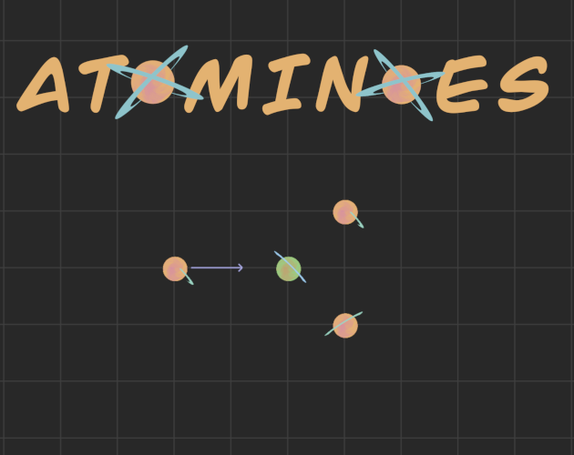

# Atominoes

  

A game made in 9 days for [Bevy Jam #6](https://itch.io/jam/bevy-jam-6). The theme was: Chain Reaction.

Place atoms on a grid, trigger collisions, and orchestrate chain reactions to solve puzzles.

You can play it in your browser on itch.io [here](https://louisnivrat.itch.io/atominoes).

---

### License

Licensed under either of

 * Apache License, Version 2.0, (http://www.apache.org/licenses/LICENSE-2.0)
 * MIT license (http://opensource.org/licenses/MIT)

at your option.
